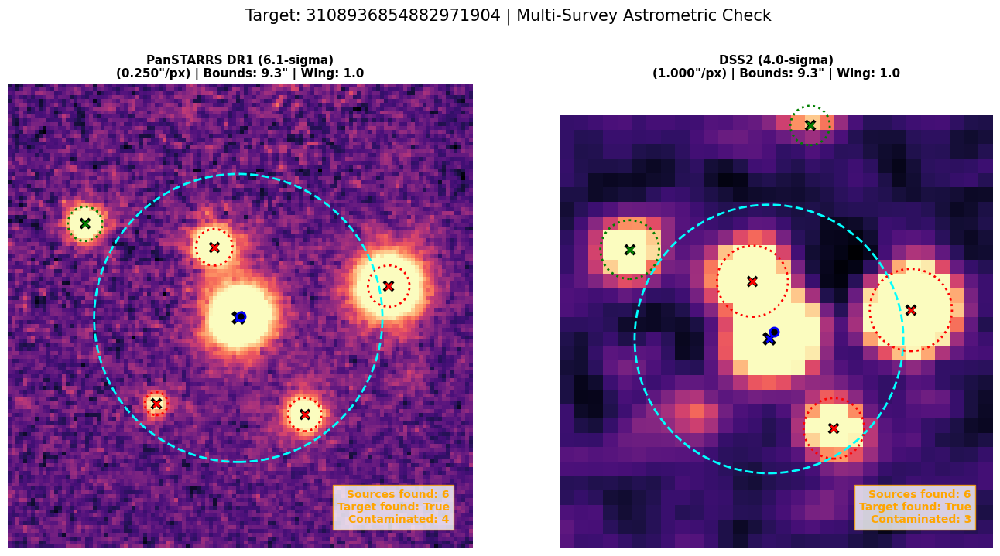
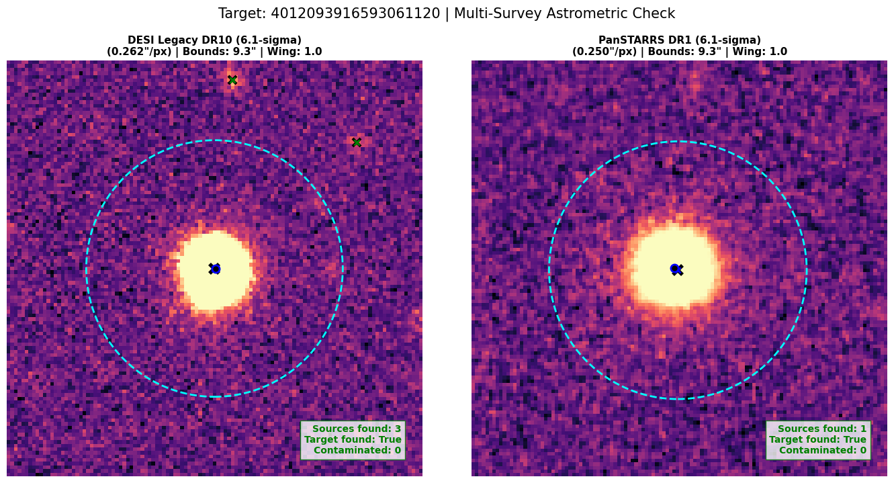
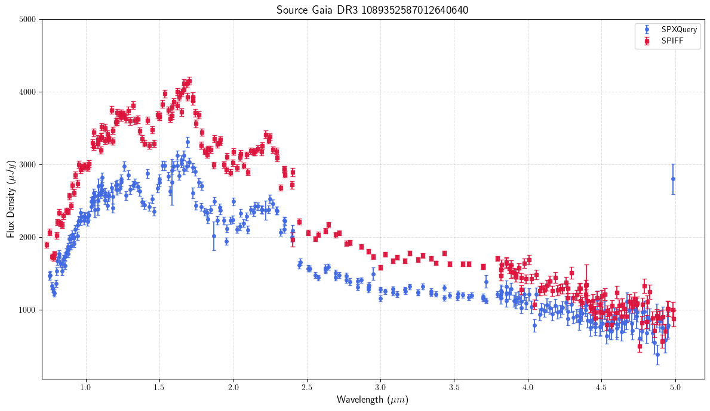
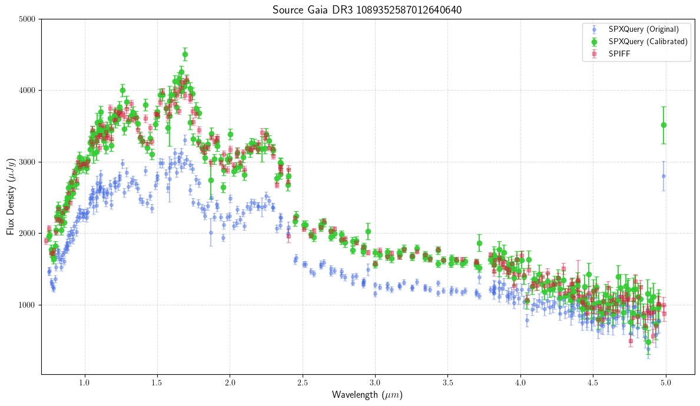

# SPHEREx Pipeline

Data pipeline for decontaminating SPHEREx sources and retrieving spectra using the SPXQuery and SPIFF packages.

## Installation

Clone the repository to your local machine and install the required dependencies:

```bash
git clone https://github.com/andrijazupic/SPHEREx_pipeline.git
cd SPHEREx_pipeline
pip install -r requirements.txt

```

## Source Decontamination

Due to the large pixel scale of SPHEREx, isolated targets can easily be contaminated by unresolved background sources. The contamination pipeline cross-references targets against high-resolution optical catalogs and direct FITS images to flag or remove blended sources. A tutorial is available in `tutorial_contamination.ipynb`.

### 1. Catalog-Level Filtering

The pipeline queries four successive survey catalogs to identify neighboring sources within a defined search radius:

*   **Gaia DR3:** Executes synchronous ADQL queries to identify basic positional blends within the search radius.
*   **DESI Legacy DR10 (Tractor):** Anchors to the central target to evaluate nearest neighbors. Filters noise using Signal-to-Noise Ratio (SNR) limits and identifies extended background sources using Tractor morphological classifications and r-band flux.
*   **Pan-STARRS DR1:** Anchors to the central target to evaluate nearest neighbors. Filters noise using Signal-to-Noise Ratio (SNR) limits and identifies extended background sources using the difference between PSF and Kron magnitudes in the r-band.
*   **SDSS DR16:** Anchors to the central target to evaluate nearest neighbors. Filters noise using Signal-to-Noise Ratio (SNR) limits and identifies extended background sources using SDSS morphological classifications in the r-band.
### 2. Image-Level Filtering

For sources that pass catalog checks, the pipeline performs direct image analysis using a World Coordinate System (WCS) PSF fitter:

* **Fallback Hierarchy:** Sequentially attempts to download optical FITS cutouts from the highest available resolution survey: DESI Legacy $\rightarrow$ PanSTARRS $\rightarrow$ SDSS $\rightarrow$ DSS2.
* **Source Fitting:** Uses `photutils.DAOStarFinder` to detect observed sources in the cutout.
* **Dynamic Flagging:** Identifies the true observed center of the target, then computes dynamic Point Spread Function (PSF) wings for all surrounding detections based on the specific survey's pixel scale and FWHM. Sources whose calculated wings intersect the target's exclusion radius are flagged.

### Usage

The pipeline is executed via the `spherex_contamination_analysis` wrapper function, which runs the input dataframe through all catalog and image filters sequentially.

**Key Parameters:**

* `df`: The input pandas DataFrame. Must contain `source_id`, `ra`, and `dec` columns.
* `search_radius_arcsec`: The radial distance to check for blending (default: 9.3").
* `remove_contaminated`:
    * If `True`: Drops contaminated rows from the dataframe at each step, returning only purely isolated sources.
    * If `False`: Retains all rows. Appends boolean flag columns (e.g., `is_contaminated_gaia`) and diagnostic notes for each survey, culminating in a master `is_contaminated` flag.


* `verbose`: Enables step-by-step console logging.

**Example Implementation:**

```python
import pandas as pd
from spherex_contamination_analysis import spherex_contamination_analysis

# Load your target catalog
df = pd.read_csv("my_targets.csv")

# Run the contamination pipeline
result_df = spherex_contamination_analysis(
    df, 
    search_radius_arcsec=9.3, 
    remove_contaminated=False, 
    verbose=True
)

# Inspect results
print(result_df[['source_id', 'is_contaminated', 'note_image']].head())

```

### Visual Diagnostics
The pipeline includes a `plot_survey_comparison` function to visually verify the automated flagging. It fetches the two highest-resolution available optical cutouts, calculates dynamic PSF wings based on the survey's parameters, and overlays the 9.3" SPHEREx exclusion zone.

**Example: Contaminated Source**
*(DSS2 and Pan-STARRS cutouts showing unresolved background sources within the exclusion zone)*


**Example: Clean Source**
*(DESI Legacy and Pan-STARRS cutouts confirming an isolated target)*



## Spectrum Querying and Extraction

A tutorial is available in `tutorial_SPXQuery.ipynb`. This pipeline utilizes a custom wrapper around the [spxquery](https://github.com/WenkeRen/spxquery) package for fast bulk data retrieval.

### The Aperture vs. PSF Discrepancy

While `spxquery` is highly efficient for bulk queries, it relies on fixed 3-pixel (9.3") aperture photometry. This misses faint light in the source wings, resulting in lower total flux compared to [SPIFF](https://github.com/jgagneastro/SPIFF), an extraction tool that uses highly accurate PSF fitting and proper motion tracking. However, SPIFF is computationally expensive, often requiring over two hours to extract a single source.

**The Discrepancy:** 
Raw `spxquery` aperture extraction (red) systemically underestimates flux compared to SPIFF's PSF fitting (blue) due to lost light in the source wings.


**The Correction:** 
Applying the empirical calibration wrapper scales the `spxquery` output to match SPIFF photometry, bridging the gap between processing speed and extraction accuracy.


### The Calibrated Wrapper

To combine the speed of `spxquery` with the accuracy of SPIFF, the wrapper applies an empirical calibration. It calculates a magnitude-dependent correction factor across 10 wavelength bins, utilizing smooth interpolation to prevent discontinuities at bin edges. This effectively scales the fast aperture extraction to match SPIFF's PSF photometry.

The wrapper manages all data handling locally: it downloads the necessary 20x20 pixel cutouts, performs the spectrophotometry, and then automatically deletes all temporary directories to preserve disk space, leaving only the final parsed `.csv` file.

### Usage

The extraction is handled by `spxquery_get_spectrum_calibrated`.

**Key Parameters:**

* `calibrate`:
    * If `True`: Applies the PSF correction. The output file retains the original `flux` and `flux_error` columns, and appends `flux_calib`, `flux_error_calib`, and the specific `correction_factor` applied to each row.
    * If `False`: Bypasses the calibration and simply moves the raw `spxquery` output file untouched.

* `outdir`: The destination directory for the final `[source_id].csv` files.
* Original headers (denoted by `#`) from the `spxquery` output are preserved in both modes.

**Example Implementation:**

```python
from spxquery_wrapper import spxquery_get_spectrum_calibrated

# Extract and calibrate a single source from a dataframe row
source_df = spxquery_get_spectrum_calibrated(
    source_id=row['source_id'],
    ra=row['ra'], 
    dec=row['dec'], 
    calibrate=True, 
    outdir="spxquery_results_calib",
    verbose=True
)

# Inspect the calibrated columns
print(source_df[['wavelength', 'flux', 'flux_calib', 'correction_factor']].head())

```